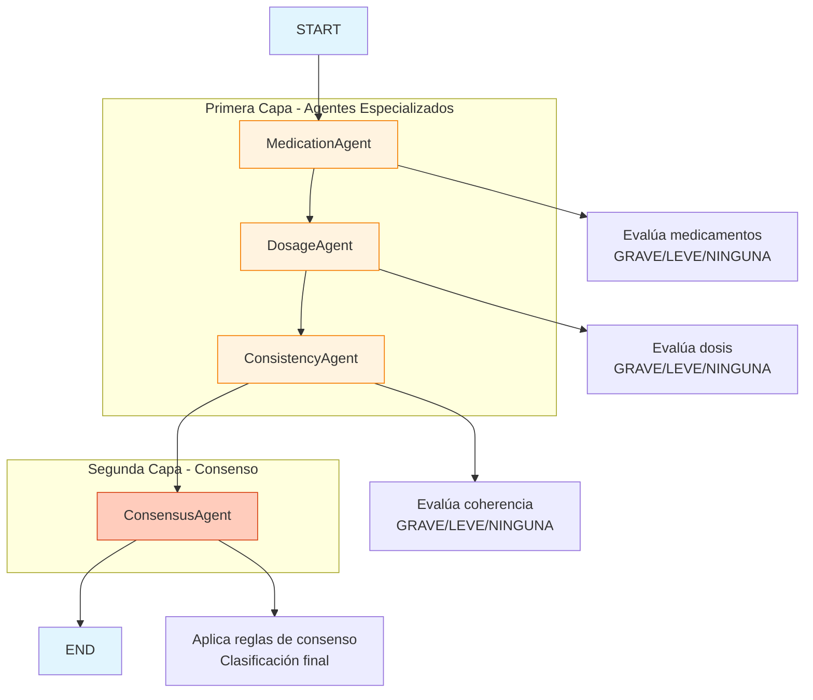

# Evaluación de Transcripciones Médicas con LangGraph

Este proyecto implementa un sistema de evaluación de transcripciones médicas utilizando LangGraph con una arquitectura de múltiples agentes especializados.

## Arquitectura

### Primera Capa (Agentes Especializados)
Tres agentes analizan el texto de forma independiente:

1. **MedicationAgent** - Verifica la fidelidad de los nombres de medicamentos
2. **DosageAgent** - Verifica la exactitud de dosis, unidades y frecuencia
3. **ConsistencyAgent** - Evalúa la coherencia general del contenido médico

### Segunda Capa (Agente de Consenso)
Un agente final combina las decisiones individuales siguiendo reglas específicas para determinar la clasificación global.

### Diagrama de Flujo del Sistema



**Leyenda:**
- 🟠 **Agentes Especializados**: Analizan aspectos específicos del texto médico
- 🔴 **Agente de Consenso**: Combina decisiones y genera resultado final
- 🔵 **Nodos del Sistema**: Puntos de control del flujo de ejecución

## Criterios de Clasificación

Cada agente clasifica en tres categorías:

- **NINGUNA**: Sin errores significativos
- **LEVE**: Errores menores que no afectan el significado clínico
- **GRAVE**: Errores que cambian el significado clínico o ponen en riesgo al paciente

## Reglas de Consenso

1. Si cualquiera de los agentes devuelve **GRAVE** → resultado final = **GRAVE**
2. Si la mayoría devuelve **LEVE** → resultado final = **LEVE**
3. Si la mayoría devuelve **NINGUNA** → resultado final = **NINGUNA**

## Instalación

```bash
pip install -r requirements.txt
```

## Configuración

Crear un archivo `.env` con la clave de OpenAI:

```
OPENAI_API_KEY=tu_clave_aqui
```

## Uso Básico

```python
from medication_evaluation_graph import medication_evaluation_graph

# Estado inicial
initial_state = {
    "original_text": "El paciente toma 200 mg de ibuprofeno cada 8 horas",
    "transcribed_text": "El paciente toma 200 miligramos de iboprofen cada 8 horas",
    "medication_classification": None,
    "dosage_classification": None,
    "consistency_classification": None,
    "final_classification": None,
    "explanations": [],
    "consensus_explanation": ""
}

# Ejecutar evaluación
result = medication_evaluation_graph.invoke(initial_state)

print(f"Clasificación final: {result['final_classification']}")
print(f"Explicación: {result['consensus_explanation']}")
```

## Ejemplos de Evaluación

### Ejemplo 1: Medicamento con error grave
- **Original**: "El paciente toma Celebrex para el dolor articular"
- **Transcrito**: "El paciente toma Cerebyx para el dolor articular"
- **Resultado esperado**: GRAVE (Celebrex ≠ Cerebyx)

### Ejemplo 2: Dosis con error grave
- **Original**: "Tomar 20 mg de warfarina al día"
- **Transcrito**: "Tomar 200 mg de warfarina al día"
- **Resultado esperado**: GRAVE (cambio en cantidad)

### Ejemplo 3: Error leve en coherencia
- **Original**: "No tiene alergias conocidas"
- **Transcrito**: "Tiene alergias conocidas"
- **Resultado esperado**: GRAVE (cambio en significado clínico)

## Estructura del Proyecto

```
Evals/
├── medication_evaluation_graph.py  # Implementación principal del grafo
├── requirements.txt                 # Dependencias
├── README.md                       # Esta documentación
└── examples/                       # Ejemplos de uso
```

## Agentes Especializados

### MedicationAgent
**Función**: Comparar nombres de fármacos entre texto original y transcripción.

**Criterios**:
- NINGUNA: Mismo medicamento (considerando abreviaturas y ortografía)
- LEVE: Variación menor que no cambia la identidad del fármaco
- GRAVE: Medicamento diferente

### DosageAgent
**Función**: Verificar dosis, unidades y frecuencia.

**Criterios**:
- NINGUNA: Misma dosis (ignorando formato)
- LEVE: Diferencia menor sin cambiar la dosis
- GRAVE: Cambio en cantidad, unidad o frecuencia

### ConsistencyAgent
**Función**: Verificar coherencia general del contenido médico.

**Criterios**:
- NINGUNA: Mismo sentido clínico
- LEVE: Detalle secundario omitido/cambiado
- GRAVE: Cambio importante en significado clínico

## Salida del Sistema

El sistema devuelve:
- Clasificación individual de cada agente
- Clasificación final consensuada
- Explicación detallada del proceso de decisión

## Consideraciones de Seguridad

- El sistema está diseñado para evaluación médica
- No reemplaza el juicio clínico profesional
- Las clasificaciones GRAVE requieren revisión humana inmediata
